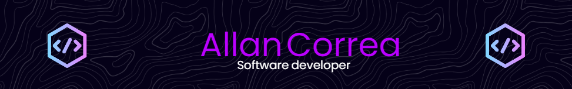

  

  

<h1 align="center">Seja bem-vindo(a) ao meu perfil! 👋</h1>

  <em>“A mente que se abre a uma nova ideia jamais voltará ao seu tamanho original.” – Albert Einstein</em>

---

## 👨‍💻 Sobre mim

Meu nome é **Allan Correa**, sou estudante de **Engenharia de Software** com formação técnica em **Análise e Desenvolvimento de Sistemas** pelo SENAI. Tenho experiência como **assistente de e-commerce**, além de prática em desenvolvimento web, design, cibersegurança e bancos de dados.

Sou apaixonado por resolver problemas, aprender coisas novas e transformar ideias em soluções funcionais e criativas. Busco oportunidades para evoluir como desenvolvedor e criar projetos inovadores, incluindo no mundo dos games e da automação.

---

## 🚀 Tecnologias que já utilizei

  <!-- Linguagens de programação -->
  <code></code>
  <code></code>
  <code></code>
  <code></code>
  <code></code>
  <code></code>
  <code></code>
  <code></code>
  <code></code>
  <code></code>
  <code></code>

  <!-- Frameworks e Ferramentas -->
  <code></code>
  <code></code>
  <code></code>
  <code></code>
  <code></code>
  <code></code>

  <!-- Design e UI/UX -->
  <code></code>
  <code></code>
  <code></code>

---

## 📊 GitHub Insights

  
  

---

## 📚 Atualmente estudando

- TypeScript  
- Roblox Lua Game Development  
- Testes Automatizados (Jest, Cypress)  
- APIs com Node.js e segurança em back-end  

---

## 🌎 Conecte-se comigo

📧 AllanCorr3a@gmail.com

---

  
   
  <em>“Criar com propósito. Aprender com paixão. Compartilhar com humildade.”</em>

